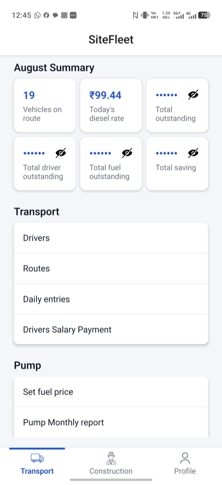
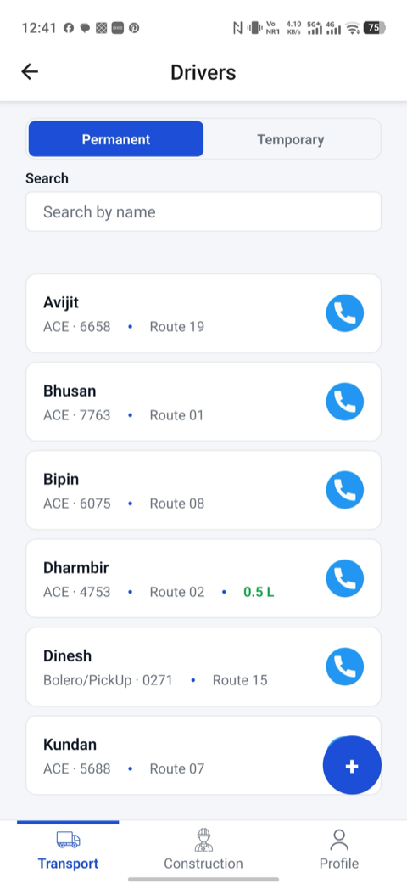
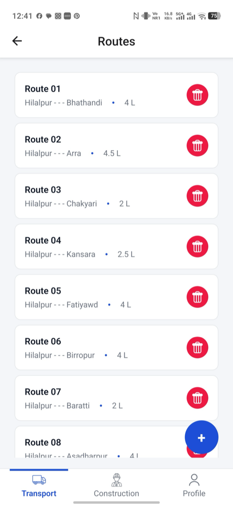
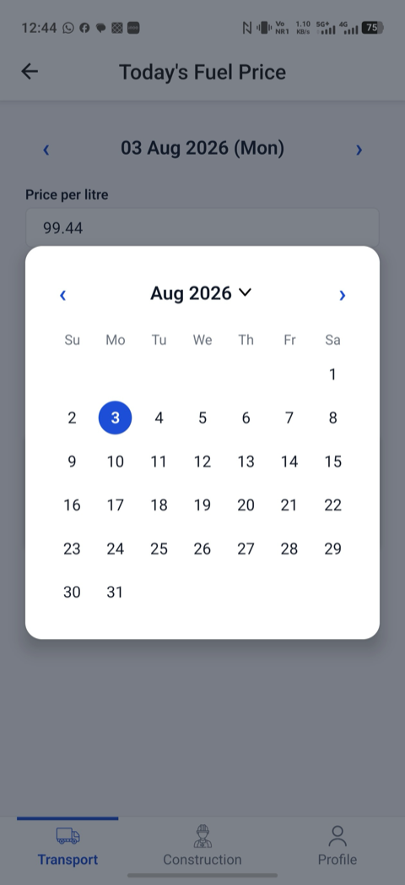
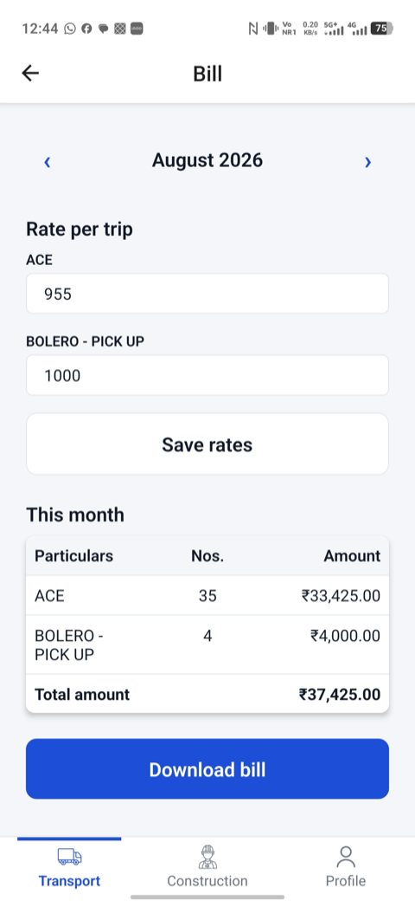
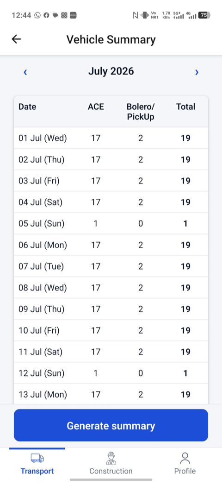

# SiteFleet

Manage vehicle fleets, drivers, and construction sites — attendance, fuel logs, and UPI payments, built with React Native + Firebase.

Internal, single-user app for managing a transport business: hiring vehicles with drivers on a per-day contract basis to deliver mid-day meals to government schools, tracking driver pay and fuel cost separately, and settling driver payments via UPI at month end.

Distributed as a sideloaded APK (not published to app stores). Cloud data via Firebase, tied to the admin's Google account.

## Screenshots

| Dashboard | Drivers list | Routes list |
|---|---|---|
|  |  |  |
| Masked payment/fuel summary tiles and the sectioned Transport nav list. | Permanent/Temporary segmented list with per-driver fuel balance. | Fixed per-route fuel allotments feeding the fuel-balance ledger. |

| Date picker | Bill | Vehicle summary |
|---|---|---|
|  |  |  |
| Custom calendar modal shared by every date/month navigator in the app. | Editable rate-per-trip with a PDF invoice matching the business's existing paper format. | Date-wise ACE vs. Bolero/PickUp attendance counts for a month. |

## Tech stack

- Bare React Native CLI, TypeScript (strict mode)
- Firebase JS SDK — Auth (Google Sign-In), Firestore, Storage
- React Navigation (native stack)
- Zustand for global state
- React Hook Form + Zod for forms and validation
- date-fns for date handling

## Architecture & key decisions

A few decisions worth calling out for anyone skimming the code:

**Per-owner data isolation via Firestore rules, not a shared admin account.** This started as a single-admin app but is actually used by multiple family members, each with their own drivers, routes, and payments. Every document carries an `ownerId` (the creator's Firebase Auth UID), every query filters by it client-side, and Firestore security rules enforce the same match server-side — so isolation holds even if a client bug ever sent the wrong query. Any authenticated Google account can use the app; access control is just "did you write this document," not an allowlist of specific users.

**Fuel-balance ledger: snapshot vs. actual, carried forward as credit or deficit.** Each route has a fixed diesel allotment (`routeFuelLitres`, snapshotted onto the `DailyEntry` at save time); each entry also records the driver's *actual* litres taken (`fuelLitres`), which can be more than the route needs (an advance) or less. A driver's running fuel balance is the cumulative `fuelLitres - routeFuelLitres` across all their present-day entries — positive means they're carrying a fuel credit, negative means they owe fuel back. This lets a driver fill up once and draw down the surplus across several routes and months without any separate "advance" bookkeeping.

**`settlementType` is derived, never a manual toggle.** Whether a driver is paid same-day (via UPI, immediately) or bundled into month-end aggregation follows directly from their `driverType` (temporary vs. permanent) at the moment an entry is saved. An earlier version had a manual per-entry toggle; it was removed because the two concepts always moved together in practice, and a manual toggle was just an extra place for the same fact to go stale or get set wrong.

**Case study — Android touch freeze after every save.** The entire app would go touch-unresponsive after any Firestore write, recoverable only by rotating the device. *Root cause*, found via live `adb`/`uiautomator` inspection on a physical device: `android:windowSoftInputMode="adjustResize"` in the manifest made Android resize the native window on every keyboard open/close, and on this device that resize left the touch-input transport geometry stale relative to what was actually on screen — only a forced full relayout (rotation, or even an `adb` screenshot call) resynced it. *Fix*: switch to `adjustPan`, a one-line manifest change, verified with a real native rebuild rather than a JS reload.

**Case study — iOS modal-transition deadlock.** An earlier UPI payment flow closed one `<Modal>` and opened a second one in the same tick to move from "enter UPI ID" to "choose UPI app." On iOS this caused a genuine native UI-thread deadlock — the app froze completely and didn't recover on its own, since it wasn't a JS crash but a native modal-presentation conflict. *Fix*: collapse the flow into a single persistent `<Modal>` that switches between steps via internal state, and never close-then-immediately-open two separate modals. This became a standing rule for every later multi-step modal in the app (the Diesel Distribution driver/litres picker follows it too).

## Getting started

### Prerequisites

- Node.js
- For iOS: Xcode + CocoaPods
- For Android: Android Studio / SDK, an emulator or device

### Install dependencies

```sh
yarn install
```

iOS only, first time and after native dependency changes:

```sh
bundle install
bundle exec pod install --project-directory=ios
```

### Environment variables

Copy `.env.example` to `.env` and fill in your Firebase project credentials. `.env` is gitignored and must never be committed.

```sh
cp .env.example .env
```

### Run the app

Start Metro:

```sh
yarn start
```

In a separate terminal:

```sh
yarn android
# or
yarn ios
```

## Project structure

The app is organized around independent business modules, each with its own screens, services, and Firestore collections:

- **Transport** (`src/screens/transport/`, `src/services/`) — the module documented in this repo today: drivers, routes, daily attendance/fuel entries, fuel price and pump tracking, driver payments, and the Bill/Summary PDF reports. Reached via the bottom tab bar's Transport tab.
- **Construction** — currently a placeholder tab ("Coming soon") in the app; the scope and data model are being defined now, and the module will be built following the same per-owner, Firestore-backed pattern as Transport.
- More modules may be added the same way over time, each as its own top-level tab with its own screens/services/types, sharing the common `firebase/`, `components/`, `theme/`, and `stores/` layers.

Shared infrastructure lives at the top of `src/`: `firebase/` (Auth + Firestore setup), `navigation/` (root nav, custom tab bar), `components/` (buttons, form fields, pickers, list rows, loading skeletons), `stores/` (Zustand global state), `theme/`, and `utils/`.

## Branching and commits

- No direct commits to `main`; all work happens on feature branches merged via pull request.
- Branch names must follow `<type>/<short-description>`, where `<type>` is one of `feat`, `fix`, `chore`, `refactor`, `docs`, `test`, `ci` — e.g. `feat/driver-fuel-balance`, `fix/dashboard-crash`.
- Commit messages follow [Conventional Commits](https://www.conventionalcommits.org/) (`feat:`, `fix:`, `chore:`, `refactor:`, etc.).

## Engineering workflow

The rules above are enforced both locally, before code is pushed, and again in CI, before a PR can merge:

- **CI checks on every PR** ([`ci.yml`](.github/workflows/ci.yml)): TypeScript typecheck, ESLint, and the full Jest suite (unit tests on business logic plus a render-smoke test for every screen) — all required to pass before merging.
- **Inline review** via reviewdog ([`reviewdog.yml`](.github/workflows/reviewdog.yml)): ESLint and Prettier issues are posted as inline PR comments on changed lines, not just a pass/fail check.
- **PR title and description linting** ([`pr-lint.yml`](.github/workflows/pr-lint.yml)): the title must follow Conventional Commits format, and the description must fill in the PR template's four required sections (Context, Technical Changes, Impact Analysis, How to Test) — a PR failing either check is blocked from merging.
- **Local pre-commit enforcement** (husky + lint-staged, commitlint): a commit can't be made directly on `main`, the branch name must match the pattern above, and staged files are auto-fixed/checked by ESLint and Prettier before the commit is allowed through — the same rules enforced in CI are also enforced locally, before code is even pushed.
- **Automated release build** on every merge to `main` ([`build-apk.yml`](.github/workflows/build-apk.yml)): a signed release APK is built, uploaded as a GitHub Actions artifact, attached to a rolling GitHub Release, and also pushed to a private Google Drive folder for quick access on-device.
